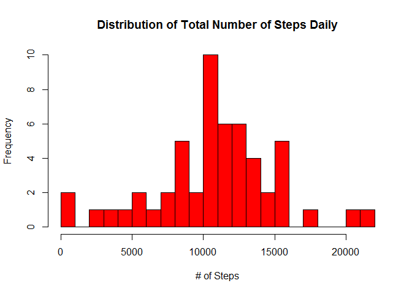
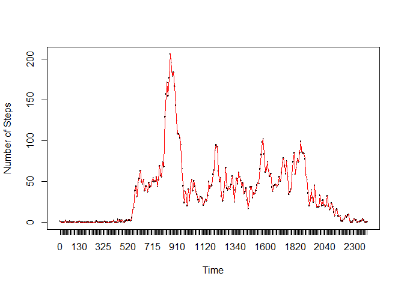
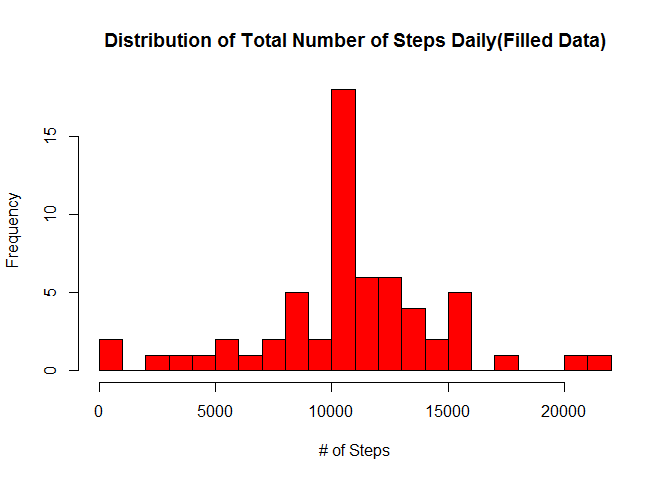
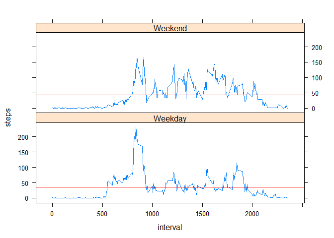

# Peer Assignment 1
Vishnu Gupta  
Wednesday, April 15, 2015  

This is an R Markdown document. Markdown is a simple formatting syntax for authoring HTML, PDF, and MS Word documents. For more details on using R Markdown see <http://rmarkdown.rstudio.com>.

When you click the **Knit** button a document will be generated that includes both content as well as the output of any embedded R code chunks within the document. You can embed an R code chunk like this:

### Load Library.

```r
library(data.table)
```

### Loading and preprocessing the data
* Download Data File

```r
fileUrl<-"https://d396qusza40orc.cloudfront.net/repdata%2Fdata%2Factivity.zip";
destinFile<-"./activity_zip.zip";
download.file(fileUrl, destfile = destinFile,method="curl");
```

```
## Warning: running command 'curl
## "https://d396qusza40orc.cloudfront.net/repdata%2Fdata%2Factivity.zip" -o
## "./activity_zip.zip"' had status 127
```

```
## Warning in download.file(fileUrl, destfile = destinFile, method = "curl"):
## download had nonzero exit status
```

* Read Data File

```r
datafile <- read.csv("activity.csv", header=TRUE, na.strings=c("NA"));
```
Create Time Series column

* Add Time Series column

```r
datafile$wd <- as.factor(ifelse(weekdays(as.Date(datafile$date)) %in% c("Saturday","Sunday"), "Weekend", "Weekday")) ;
```


### Cleanup data and get Mean, Median and Number of Null Values

```r
nas<-is.na(datafile$steps);
stepmean<-mean(datafile[!nas,]$steps);
stepmedian<-median(datafile[!nas,]$steps);
nass<-nrow(datafile[nas,]);
```


```r
stepsum<-with(datafile, tapply(steps, date,sum));
hist(stepsum,col="red",main="Distribution of Total Number of Steps Daily",xlab="# of Steps",ylab = "Frequency", breaks=20);
```

 

Mean and Median Summary of steps daily for tidy data  - 

```r
summary(stepsum);
```

```
##    Min. 1st Qu.  Median    Mean 3rd Qu.    Max.    NA's 
##      41    8841   10760   10770   13290   21190       8
```

### Average daily activity pattern
*Time Series Chart.


```r
datafile2<-datafile[!nas,]
datafile1<-aggregate(list(steps = datafile2$steps), list(interval = factor(datafile2$interval)), mean);
plot(datafile1$interval, datafile1$steps,xlab = "Time" ,ylab = "Number of Steps");
with(datafile1, {
  lines(interval, steps  ,type='l',col  = "red");
})
```

 

### Max daily avg Number of Steps for an Interval

```r
AvgMaxSteps<-order(datafile1[,2],decreasing=T)[1];
AvgMaxSteps<-datafile1[which.max(datafile1$steps), ];

print(AvgMaxSteps);
```

```
##     interval    steps
## 104      835 206.1698
```
### Imputing missing values
Number of rows with 'NA' Values are - 

```r
nass;
```

```
## [1] 2304
```

### Updating missing values with average for that interval.

```r
datafilez<-datafile[nas,]
datafilezz<-data.frame(date=datafilez$date, wd=datafilez$wd, interval=datafilez$interval, steps=datafile1[match(datafilez$interval,datafile1$interval), 2]);
datafile11=rbind(datafilezz,datafile2);
datafileNew<-aggregate(datafile11["steps"], list(interval=datafile11$interval,wd=datafile11$wd), mean);
stepsum<-with(datafile11, tapply(steps, date,sum));
hist(stepsum,col="red",main="Distribution of Total Number of Steps Daily(Filled Data)",xlab="# of Steps",ylab = "Frequency", breaks=20);
```

 
* The Values are different than the one we got previously.
Now the Mean is same as Previous value and Median became the same as Mean.
### Mean and Median Summary of steps daily for updated data  - 

```r
summary(stepsum);
```

```
##    Min. 1st Qu.  Median    Mean 3rd Qu.    Max. 
##      41    9819   10770   10770   12810   21190
```

### Activity patterns differences between weekdays and weekends
There are seveeral peaks during the day for both Weeknds and Weekdays but there are notable differences

* Peak in weekend is lower than the peak during weekdays.

* During weekdays there is comparatively more activity between 500 to 830.

* During weekends there is comparatively more activity between 1900 to 2100.

* During Weekdays Average number of steps is less than the weekends.


```r
library(lattice)
    ff<-factor(datafileNew$wd);

p<-xyplot(steps~interval|ff ,data=datafileNew,panel=function(x, y) {
         panel.xyplot(x,y,type='l')
         panel.abline(mean(y),col="red")
        },type='l',layout=c(1,2));       
    print(p)
```

 


